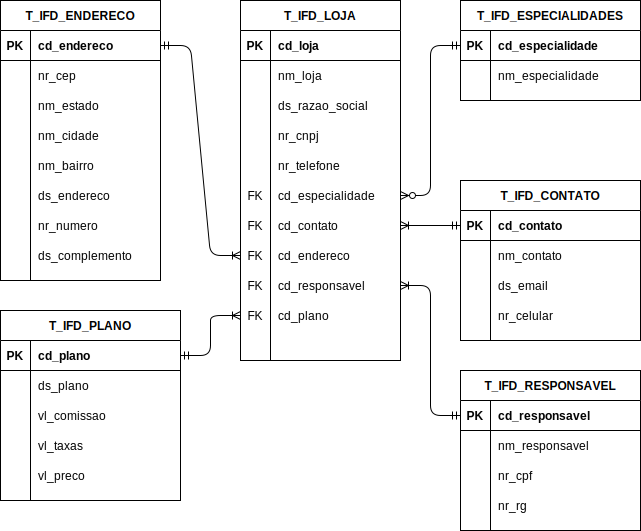
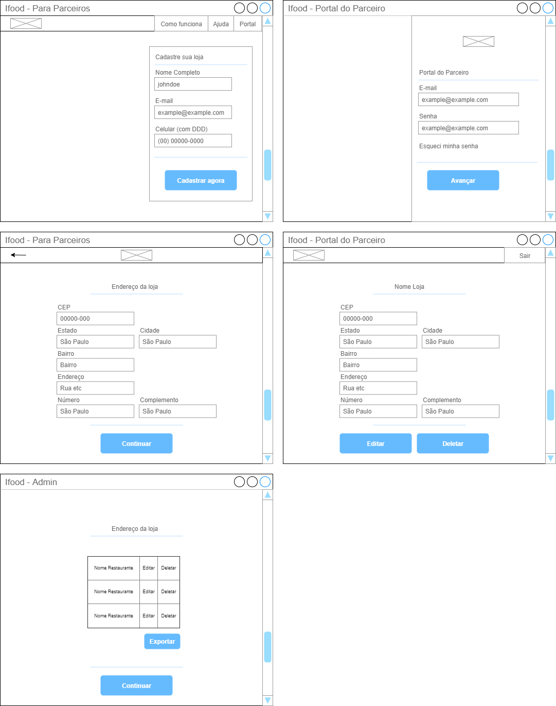

# Ifood Restaurants

## Description

Restaurant Module CRUD

**Challenge**:
Which are the most relevant data for the partner restaurant provide at Ifood Platform registration, to help IFood validate and create products?

## Stack

- No Fancy frameworks
- Maven
- JSP
- JSTL
- EL
- Java
- Servlets
- SGDB Oracle

## Requirements

- **Tomcat** _9.0.54_ (versions 10.x and above use Jakarta Servlet API instead of Javax)
- Java **JDK** 17
- Docker
- Oracle Database 12.2.0.1-slim Docker image

_Can be developed both at eclipse or vscode, to use vscode install java extension pack and tomcat for java_

## Data Model

Star Schema _WANNABE_

## Views

## Database Properties

- **prod**: src\main\resources\db.properties
- **test**: src\test\resources\db.properties

## DOD

- [x] Understanding of Business Model
- [x] Data Modeling
- [ ] Data Persistence (CRUD)
- [ ] Front-end
- [ ] 3 Insights from data
- [ ] Pitch

## Group

_Me, myself and I_

## TODOs & Technical Debts

- [ ] Create a Logging Factory
- [ ] Use Mocking for tests
- [ ] Use a in Memory database for tests?
- [ ] **Change** Address.address to Address.something
- [ ] Add setDescription to StoreTest at Entities Test
- [ ] Make tests for each DAO method separately (They`re current together)
- [ ] Improve servlets endpoint names

- http://localhost:8383/fiap-ifood-challenge/
- http://localhost:8080/
